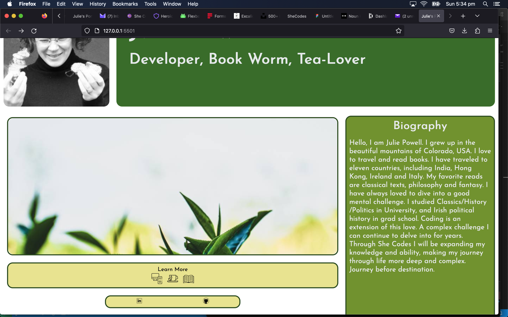

# Julie Powell - Portfolio Task
[My portfolio site](  https://thellamiechan.github.io/SheCodes-Portfolio/  )

## Project Requirements

### Content
I added a photo of myself and put the bio on the right side of the screen. The photo gallery is decorative, but the "buttons" underneath contain all the links. Page two is linked in the top yellow button and linkedin and git in the second.
- [x] At least one profile picture
- [x] Biography (at least 100 words)
- [x] Functional Contact Form
- [x] "Projects" section
- [x] Links to external sites, e.g. GitHub and LinkedIn.

### Technical
I added the second page to contain all the projects, mostly the ones I will make in this course. To start with the boxes simply contain the logos and list of languages. As projects get linked during the course, this page will gain more interest. I added a contact me box on the 2nd page, the form emails me. 
- [x] At least 2 web pages.
- [x] Version controlled with Git
- [x] Deployed on GitHub pages.
- [x] Implements responsive design principles.
- [x] Uses semantic HTML.

### Bonus (optional)
Add a short paragraph describing the features below, if you included any. 
- [ ] Different styles for active, hover and focus states.
- [ ] Include JavaScript to add some dynamic elements to your site. (Extratricky!)

### Screenshots
> Please include the following:
> - The different pages and features of your website on mobile, tablet and desktop screen sizes (multiple screenshots per page and screen size).
> - The different features of your site, e.g. if you have hover states, take a screenshot that shows that.

You can do this by saving the images in a folder in your repo, and including them in your readme document with the following Markdown code:

#### {{ image_title }}

![ {{ screen shot p2 phone }} ]
![ {{ screen shot p1 tablet }} ]
![ {{ screen shot p2 tablet }} ]
![ {{ screen shot p1 pc }} ]
![ {{ screen shot p2 pc }} ]